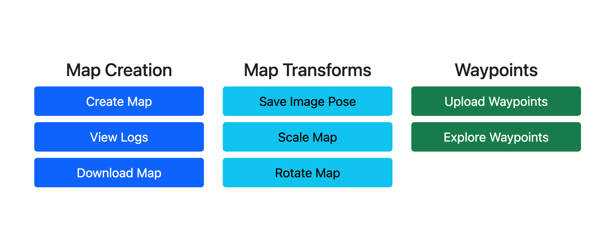

# Map Server (or Spatial Server)

This repository contains a reference implementation of a map server for OpenVPS. It provides the following functionalities:

- Map creation and storage.
- Localization against stored maps.
- Associating maps with waypoints.

We use [hloc](https://github.com/cvg/Hierarchical-Localization) (which in turn uses [SuperPoint](https://arxiv.org/abs/1712.07629) and [SuperGlue](https://arxiv.org/abs/1911.11763)) for map creation and localization.

This repository contains submodules. Clone the repo using:
```
git clone --recurse-submodules https://github.com/openvps/spatial-server.git
```

# Install dependencies and run server

## Docker-based installation

1. Install docker engine. For Ubuntu, use instructions [from here](https://docs.docker.com/engine/install/ubuntu/#install-using-the-repository).
2. Install nvidia-container-toolkit. For Ubuntu, use instructions [from here](https://docs.nvidia.com/datacenter/cloud-native/container-toolkit/latest/install-guide.html#installing-with-apt).
3. Run `nvidia-smi --query-gpu=compute_cap --format=csv` to get the CUDA Architecture. Change the `CUDA_ARCHITECTURES` ARG in the Dockerfile (without the dot).
3. `cd spatial-server`

## Running the server
Run `docker compose up --detach`. To print logs, run `docker compose logs`. To shutdown, `docker compose down`.

- If behind proxy, set the environment variable `BEHIND_PROXY` to `true`: `BEHIND_PROXY=true docker compose up --detach`.
- HTTPS is on by default. To turn off HTTPS, set the environment variable `HTTPS` to `false`: `HTTPS=false docker compose up --detach`.

**Note**: If you're making code changes, to ensure that the code changes are reflected in the docker, run: `docker compose up --detach --force-recreate --renew-anon-volumes`.

# Using the server

Once started, visit the landing page at `https://localhost:8001`. You should see the following options:



Visit [OpenVPS organization website](https://openvps.github.io/) for more information on how to use the server to create maps, set up a localization service and tag waypoints.
